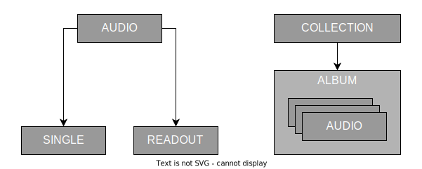

# Designing coendb

Fundamentally, [coenfuse](http://www.coenfuse.com) is a simple portfolio website. The portfolio is heterogenous and displays several different types of creative work. Each piece of work is a collection of different types of digital data like text, image, video, etc. The coendb primary requirement is to organize these data contents in such that they are easy to edit, maintain and scale. The second requirement is to abide strict and frugal economical feasibility of the whole software.

To start with, we first find all the types of data we need to organize and then analyze the possible relation between them. This helps us in creating hierarchy in similar data contents and remove redundancy in attributes.

Broadly the portfolio could display the following types of contents :
- photographs and digital illustrations
- articles or stories
- music samples
- movies or short clips
- shop items

## 1. Finding data types
After fleshing the broad types of contents listed above, we get the following rough list :

- Album   - An album of unbearable music.
- Anime   - Some animations expanding on digital graphics.
- Blog    - Simple text article.
- Films   - Short films or videos, links from YT maybe.
- Photo   - General photography and manipulations.
- Readout - Read-alouds for text articles.
- Remix   - Mixing someone else' music into a sensory torture.
- Render  - AI, video game and VFX renders.
- Single  - Unbearable music sample that I may churn out from FL Studio.
- Story   - A chapter wise series of articles, plogs, etc.
- Vector  - Vector based illustrations and digital graphics.

Now that we have rough list of content types. We can now find hierarchy of digital formats and establish relation between them. This gives us the following structure ;
#

## 2. Removing redundancy in data types
Now that we have types defined, we can identify commonalities and remove redundancies. So let's start with audio. This type of content is the lowest priority since I don't see myself creating stuff in this anytime soon. However, it requires a brief discussion nevertheless.

### 2.1 Audio files
Firstly, audio files are expected to be simple .mp3 files not more than the size of 50MBs. That too is for podcasts and long read-alouds for articles. Since this database is going to be hosted on public Github repository, it is very easy to cross the file-size warning threshold. At the time of writing, Github issues warning when a file exceeding 50MBs is pushed to remote. Furthermore, the repository size is strongly recommended to be under 5GBs.

Conclusion? Do not store actual audio files directly in the database repo. Use some publicly available cloud platform like Google Drive, Microsoft One Drive or Dropbox. All we then would have to maintain is the metadata of audio files and their cloud references.

#### 2.1.1 Single
Represents a simple music or sample production that I may upload. Since I am going to upload the audio clips on cloud, I'll be just maintaining the relevant [metadata]() only. The data uploaded on cloud platform like Google or Dropbox may not provide enough streaming bandwidth necessary to load music files like this. I may opt using a dedicated music streaming platform like Spotify or Soundcloud instead and then embedding a player.

#### 2.1.2 Remix
It is techincally similar with audio single on all accounts except the method of production. That difference is not enough for this to me marked a separate datatype. Thus we will just use 'Single' type to store remixes. 

#### 2.1.3 Album
Album is nothing but an ordered collection of Singles but with some additional [metadata](). We may store metadata in the database listing all the singles stored in cloud. Or if I am using a dedicated music streaming platform then I would just their dedicated album or collection metadata. All in all, we will have to maintain album's metadata so this data type stays. However, Album is type of collection and not an audio instance. So this will be an abstract type alongside audio sub-tree.

#### 2.1.4 Read Out
Readout is a pre-recorded audio clip for an article that is ever only going to be used within an article. The readout is going to be accessed only a few times while opening the article and thus does not require continous streaming bandwidth. It will be downloaded from cloud storage, stored in cache and then played for the user at client side. Its [metadata]() is going to be fundamentally different from the Single, thus it does require it to be maintained seperately.

#### 2.1.5 Conclusion
After the analysis above, the following is the revised audio sub-tree.

### 2.2 Image files
#### 2.2.1 Photo
#### 2.2.2 Render
#### 2.2.3 Vector

### 2.3 Text files
#### 2.3.1 Blog
#### 2.3.2 Story

### 2.4 Video files
#### 2.4.1 Anime
#### 2.4.2 Film

## 3. Establishing database structure
- [Organizing Audio files]()
- [Organizing Image files]()
- [Organizing Text files]()
- [Organizing Video files]()